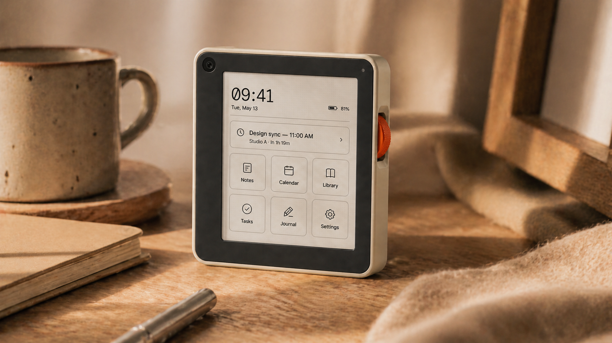
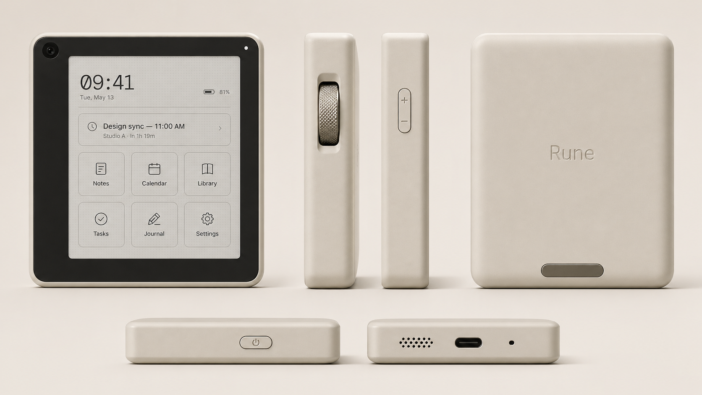
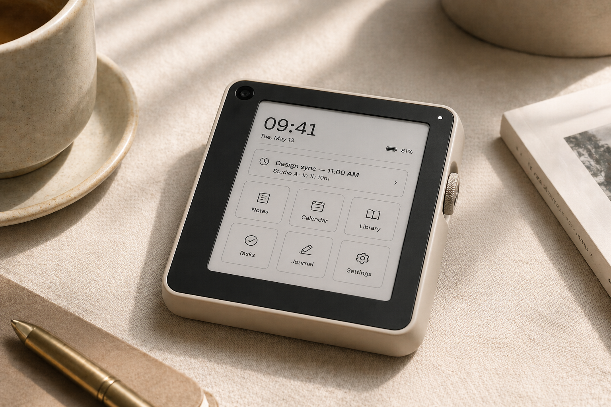

# Rune

**The pocket AI companion for focused minds.**

Rune is a 78x78x13mm open-source pocket device with a 3.7" monochrome e-ink display, built for people who want a handful of useful things done well without the attention traps of a smartphone. It runs Linux on an Allwinner T113-S4 SoC with an ESP32-S3 co-processor handling WiFi and BLE. The firmware is AGPL-3.0. The hardware is CERN-OHL-S 2.0. Everything is here in this repo.



_Concept render. Industrial design, UI labels, and final hardware details are subject to change until the released design files are tagged._

---

## Status

<!-- CI badges will go here once pipelines are configured -->
`[ build: TBD ]` `[ tests: TBD ]` `[ hardware rev: 0.1 ]`

---

## Quick Links

| Resource | Location |
|---|---|
| Design philosophy | [docs/philosophy.md](docs/philosophy.md) |
| Architecture overview | [docs/architecture.md](docs/architecture.md) |
| Hardware BOM | [hardware/BOM.md](hardware/BOM.md) |
| Build instructions | [firmware/build.md](firmware/build.md) |
| Contributing | [CONTRIBUTING.md](CONTRIBUTING.md) |

---

## What Rune Does

Rune does five things:

1. **Voice queries** -- Hold a button, ask a question, get an answer from a cloud AI. Responses render as text on the e-ink screen. Simple request-response, not a chatbot.

2. **ePub reading** -- Load books over USB or WiFi. Read them on a sharp monochrome display with physical page-turn buttons. No store, no DRM, no recommendations.

3. **Music playback** -- Play local audio files or connect to Spotify. Output through the built-in speaker or Bluetooth headphones.

4. **Phone notification mirroring** -- Pair with your phone over BLE. See incoming notifications on the e-ink display. Read them, dismiss them, nothing more.

5. **Photo capture** -- A small camera module for quick snapshots. Photos save to local storage. No filters, no sharing prompts, no cloud upload unless you set it up yourself.

---

## What Rune Doesn't Do

- **No feeds.** No social media, no news feeds, no algorithmic content.
- **No app store.** The five features above are it. You can fork and add your own, but Rune ships focused.
- **No subscription required.** The device works out of the box. Cloud AI queries require an API key you provide -- you pay the AI provider directly, not us.
- **No browser.** Not a pocket computer. A pocket tool.
- **No video.** It's an e-ink screen. This is a feature, not a limitation.
- **No telemetry.** Rune doesn't phone home. Ever.

---

## Concept Renders

These images show the current industrial design direction. Treat them as visual intent, not final manufacturing proof.

| Product views | Everyday context |
|---|---|
|  |  |

---

## Architecture

Rune runs a minimal Linux system (built with Buildroot) on the Allwinner T113-S4, a dual-core Cortex-A7 SoC. The T113 owns the user-facing peripherals: SPI drives the e-ink panel, I2S handles microphone capture and speaker playback, and USB hosts the UVC camera. The ESP32-S3 co-processor handles BLE notification mirroring and optional wireless duties, communicating with the T113 over UART. Userspace is currently aimed at Rust, with final language boundaries still pending as the prototype hardens. Power management targets multi-day battery life by leveraging e-ink's zero-power image retention and aggressive sleep states.

```
+-------------------------------------------------------+
|                      Rune Device                       |
|                                                        |
|  +------------------+ UART  +---------------------+   |
|  | Allwinner T113-S4|<----->|     ESP32-S3        |   |
|  | (main SoC)       |       |   (co-processor)    |   |
|  |  Linux (Buildroot)|       |  WiFi / BLE         |   |
|  |  Rust userspace   |       |  Notifications      |   |
|  |  SPI / I2S / USB  |       |  Low-power tasks    |   |
|  +--------+----------+       +---------------------+   |
|           |                                            |
|  +--------v----------+                                 |
|  | 3.7" e-ink display|                                 |
|  | (monochrome)      |                                 |
|  +-------------------+                                 |
|                                                        |
|  +-------------------+  +------------+  +-----------+  |
|  | Physical buttons  |  | Speaker    |  | Battery   |  |
|  | (nav + action)    |  | (mono)     |  | (LiPo)   |  |
|  +-------------------+  +------------+  +-----------+  |
+-------------------------------------------------------+
```

For the full architecture breakdown, see [docs/architecture.md](docs/architecture.md).

---

## Quick Start

There are three ways to get involved:

### Back the Kickstarter

We plan to crowdfund the first production run. Details TBD. Watch this repo for announcements.

### Build Your Own

Everything you need is in this repo:

1. **Build the breadboard prototype** -- Start with [hardware/BOM.md](hardware/BOM.md) and [docs/development/prototype-setup.md](docs/development/prototype-setup.md). The production PCB files are placeholders until the first board revision is released.
2. **Print the enclosure** -- STL placeholders live in [hardware/enclosure/](hardware/enclosure/). The current prototype can run on a flat baseplate before the enclosure is ready.
3. **Flash the firmware** -- Follow [firmware/build.md](firmware/build.md) and [firmware/flash.md](firmware/flash.md). You'll need a Linux dev environment, the ARM GCC cross-compiler, and esp-idf for the ESP32.

### Fork the Firmware

If you already have compatible hardware or just want to explore the code:

```bash
git clone [GitHub URL TBD]
cd rune/firmware
# See docs/development/ for toolchain setup and build instructions
```

---

## Repository Structure

```
rune/
  firmware/
    buildroot/     # Linux system configuration and packages
    kernel/        # Kernel modules and device tree overlays
    userspace/     # Rust applications (voice, reader, music, notifications, camera)
    esp32/         # ESP32-S3 co-processor firmware (C/C++, esp-idf)
  hardware/
    schematics/    # KiCad schematics
    pcb/           # PCB layout, Gerbers, BOM
    enclosure/     # Mechanical design (3D-printable enclosure)
  docs/
    philosophy.md  # Design philosophy -- read this first
    architecture.md
    development/   # Build guides and toolchain setup
```

---

## License

Rune uses two licenses to cover firmware and hardware separately:

- **Firmware** (everything under `firmware/`): [GNU Affero General Public License v3.0 (AGPL-3.0)](https://www.gnu.org/licenses/agpl-3.0.html). If you modify the firmware and provide it as a service, you must share your changes.

- **Hardware** (everything under `hardware/`): [CERN Open Hardware Licence Version 2 - Strongly Reciprocal (CERN-OHL-S 2.0)](https://ohwr.org/cern_ohl_s_v2.txt). If you manufacture modified hardware, you must share your design changes.

- **Documentation** (everything under `docs/`): [Creative Commons Attribution-ShareAlike 4.0 (CC BY-SA 4.0)](https://creativecommons.org/licenses/by-sa/4.0/).

Full license texts are in [LICENSE](LICENSE) and [hardware/LICENSE](hardware/LICENSE).

---

## Acknowledgments

Rune stands on the work of others:

- **[Open Interpreter 01](https://github.com/OpenInterpreter/01)** -- The original inspiration for a small, open, AI-first device. Rune takes a different path (focused features instead of general-purpose computing) but the 01 project proved the concept was worth building.
- **Allwinner sunxi community** -- Years of reverse engineering and mainline Linux support for Allwinner SoCs make projects like this possible. The [linux-sunxi wiki](https://linux-sunxi.org/) is invaluable.
- **Waveshare** -- For manufacturing accessible e-ink displays with solid documentation.
- **The Buildroot project** -- For making embedded Linux builds reproducible and maintainable.
- **The Rust embedded ecosystem** -- `embedded-hal`, `probe-rs`, and the broader community making systems programming safer.

---

*Rune is built in the open. If you find problems, open an issue. If you want to help, read [CONTRIBUTING.md](CONTRIBUTING.md) and the [philosophy doc](docs/philosophy.md) first.*
